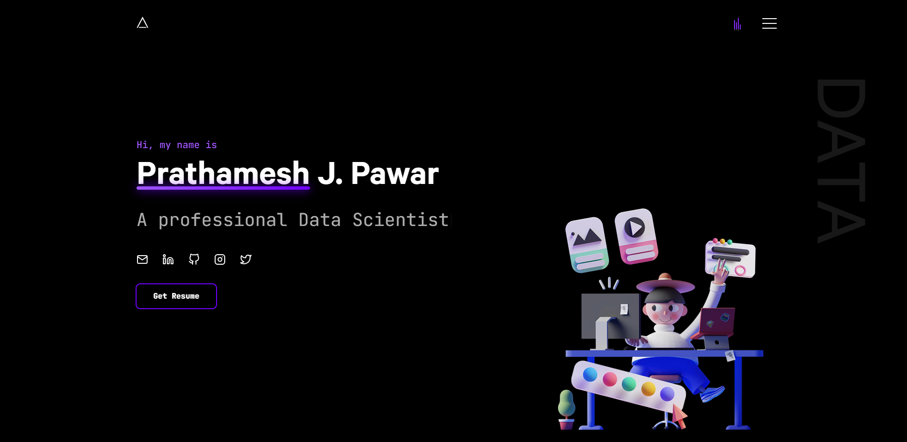

# Prathamesh J. Pawar

Welcome to my personal portfolio website! This repository contains the code and resources for my portfolio, hosted at [Live](https://prathameshpawar-mu.vercel.app/).

## About the Website

This portfolio showcases my professional journey, projects, and skills as a Data Scientist, Web Developer, and Business Consultant. It's designed to give potential employers and collaborators insight into my work and expertise.

## Screenshot

## Features

- **✨ Responsive Design**: The website is optimized for all devices, from desktops to smartphones.
- **🎨 Interactive UI**: Smooth navigation and visually appealing design.
- **📂 Project Showcase**: Highlights my key projects, including:
  - 📊 **RAG/Fine-Tuning Multi PDF Chat/Summary**: A dashboard for sales forecasting and inventory management using grocery data.
  - 💊 **Medicine Recommendation System**: A healthcare project recommending medicines based on patient needs.
  - 🤖 **Car Price Prediction**: An advanced chatbot leveraging fine-tuned Llama 3 for contextual conversations.
  - 😄 **Face Expression Detection**: A machine learning model trained on 28k images to detect human expressions.
  - 📝 **Blinkit Sales Dashboard**: Summarizing and interacting with multi-PDF documents using RAG techniques.
  - 📦 **HR Analytics Dashboard**: An analytical tool for monitoring and improving dropshipping performance.
- **💼 Experience and Skills**: Displays my certifications, internships, and areas of expertise.
- **📞 Contact Section**: Links to my social media and email for easy connection.

## Technologies Used

- **Frontend**: HTML, CSS, JavaScript, Bootstrap, React
- **Backend**: Next.js
- **Hosting**: Vercel

## Contact

Feel free to connect with me:
- **📧 Email**: prathmeshpawar212002@gmail.com
- **💼 LinkedIn**: [My LinkedIn](https://www.linkedin.com/in/prathameshpawar21/)
- **🐙 GitHub**: [My GitHub](https://github.com/Prathmeshpawar21)

---

Thank you for visiting my portfolio! If you find this repository useful, consider giving it a ⭐ to show your support.
